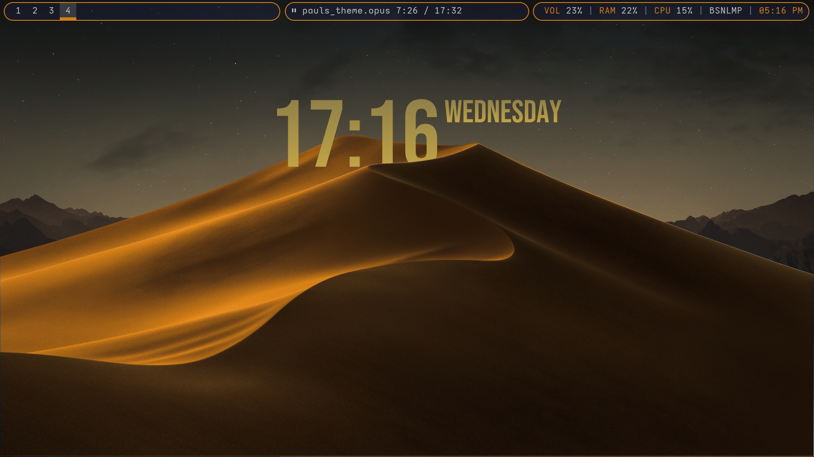

# SweetDunes


# Disclaimer

This rice is not meant for the best performance but for aesthetics. Many things (especially the clock) could definitely be improved. Any contributions are welcome. Also I use Arch BTW.

## Dependencies

```
i3-gaps picom-git rofi polybar sddm mpd
```

## Installation

### For Arch

Install the dependencies, [i3](https://wiki.archlinux.org/title/I3), [sddm](https://wiki.archlinux.org/title/SDDM) beforehand, the installer will not install these. Also dont forget to install [xorg](https://wiki.archlinux.org/title/Xorg)

```
$ sudo pacman -S rofi polybar mpd mpc
```
[picom-git](https://aur.archlinux.org/packages/picom-git) needs to be installed from the AUR. See [AUR Installation Instructions](https://wiki.archlinux.org/title/Arch_User_Repository)

Clone this repo into your home directory and run install script (has not been tested, but its relatively simple, should work on a fresh arch install)
```
$ cd ~
$ git clone https://github.com/MrGizmo123/SweetDunes
```
